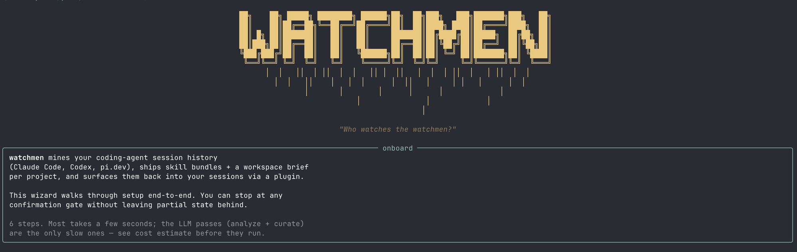

<p align="center">
  
</p>

<h1 align="center">watchmen</h1>

<p align="center">
  <em>Watchmen turns every coding session into the skill bundles you’d never sit down and write yourself.</em>
</p>

<p align="center">
  <a href="#install">Install</a> ·
  <a href="#what-watchmen-actually-does">What it does</a> ·
  <a href="#mission-control">Mission control</a> ·
  <a href="#how-it-works">How it works</a> ·
  <a href="#cost--privacy">Cost &amp; privacy</a>
</p>

---

Reusable skills and workspace briefs, built from what you actually do, carried
across Claude Code, Codex, and pi.dev. You install it once and never change how
you work.

The manual fix is writing a `CLAUDE.md` or `AGENTS.md` by hand, but that's you
doing the learning on behalf of the agent. That's backwards.

watchmen sits behind **Claude Code**, **Codex**, and **pi.dev**. It silently
watches your sessions, mines what you actually do, and writes skill bundles +
workspace briefs (`CLAUDE.md` / `AGENTS.md`) so your next session is smarter
than your last. Same skills follow you across agents — switch between Claude
Code and Codex on the same repo and they pick up where the other left off.

## Why it matters

- **Fewer tokens burned re-explaining yourself.** Your agent stops
  rediscovering the same procedures every session. The skill is already on
  disk, so context that used to be spent re-deriving it isn't.
- **Fewer tool errors per session.** watchmen's own impact card tracks median
  tool errors before and after a project's skills land, on a 16-week curve.
- **Unified context layer across every agent.** Switch from Claude Code to
  Codex in the middle of development and the skills you need will follow. No
  need to re-onboard the new agent.

**Local storage, cross-agent, continuous.**

watchmen stores transcripts, metrics, analyses, and generated bundles on your
machine. Analysis runs send selected session excerpts to OpenRouter using your
API key; nothing is uploaded outside those explicit LLM calls.

## What watchmen actually does

While you work, it:

- 🤖 **Captures sessions from every agent** — Claude Code (`~/.claude/projects/`), Codex (`~/.codex/sessions/`), pi.dev. One corpus across tools.
- 📚 **Auto-curates skills** — recurring procedures get turned into runnable skill bundles your agent can call: `SKILL.md` + scripts + references.
- ✍️ **Auto-writes CLAUDE.md + AGENTS.md** — workspace brief, identical content for both, refreshed continuously.
- 📈 **Surfaces what's working** — mission control web UI, per-project impact tracking, friction signals, action queue.
- 💡 **Retrospective skill hints** — when you could've used an existing skill, the next statusLine update tells you. Never modifies your agent's context. Never blocks you.

You install it. It runs. Your agents get better every day you use them.

## The CLI

```
watchmen init
```

<p align="center">
  
</p>

Six steps. Most run in seconds; the LLM passes (analyze + curate) are the only slow ones — you see the cost estimate before they run. Stop at any confirmation gate; nothing partial is left behind.

## Mission control

A local web dashboard at `http://127.0.0.1:8979` — no hosted account or remote
dashboard. Top-of-page tells you:

- **Skill calls this week vs last week** — are your curated skills being invoked?
- **Tool errors per session** — is friction going up or down?
- **Active repos** — what's getting work this week?
- **Skill leaderboard** — which repo's skills are firing most
- **Status tiles** — traffic-light health per project (healthy / stale / uncurated)
- **Next actions** — ranked queue, e.g. "kai-bench has 28 prompts to analyze · Run"

### Per-project impact

Drill into any tracked repo and you get a **before/after** view scoped to that project. 16-week chart of tool errors per session with a dashed annotation at the date the curator first landed. Pre/post comparison table: sessions, median tool errors, median prompts, median cost. Honest empty states when there isn't enough post-treatment data yet — never silently disappears.

Subtitle reads "Correlation only — not a controlled experiment." We don't oversell the signal.

### Three themes

Light comic-pulp newsprint by default. **Doomsday** noir mode for the dark-mode crowd. **Rorschach** sepia-typewriter for diary-mode fans. Switch instantly at `/settings` — picker persists per browser via `localStorage`, no reload.

> Dashboard + impact-card screenshots ship with v0.6 — generated against a mock corpus so no real project data leaks into the docs.

## Install

Three commands and a wizard. Total wall time ~10 min + 30–90 min per project of LLM passes.

```bash
git clone https://github.com/firstbatchxyz/watchmen.git
cd watchmen
uv sync && uv tool install --editable .
watchmen init
```

The wizard handles everything: prompts for your `OPENROUTER_API_KEY` (saves to `~/.config/watchmen/.env`, chmod 600), ingests your `~/.claude/projects/` history, lets you pick which projects to analyze, previews the cost, runs analyze + curate with live progress, installs the launchd/systemd daemon + viewer for autostart, and shows you the exact `/plugin` commands to paste inside Claude Code.

Runtime data lives under `~/.watchmen/` (`state.db`, `corpus.db`, `analyses/`, `bundles/`, event logs). Set `WATCHMEN_HOME=/path/to/dir` for an alternate location.

`watchmen doctor` does a one-screen ✓/✗ check across API key, corpus, daemon, viewer, and hooks if anything looks off.

### Plugins

After `watchmen init`, install the plugins inside each agent. **Claude Code:**

```
/plugin marketplace add firstbatchxyz/watchmen
/plugin install watchmen@watchmen
/reload-plugins
```

Then wire the statusLine (one-time):

```bash
watchmen statusline install
```

**Codex:**

```
/plugins marketplace add github:firstbatchxyz/watchmen
/plugins install watchmen
```

You then get `/skills brief` (or `$brief`) inside Codex with the same workspace digest behavior as `/watchmen:brief` in Claude Code. Codex has no statusline, so the live skill-suggestion hint is on-demand `brief` instead.

## Requirements

- macOS or Linux (Windows: WSL works; native untested)
- [`uv`](https://github.com/astral-sh/uv) (Python toolchain) — Python 3.11+
- An OpenRouter API key (`OPENROUTER_API_KEY`)
- At least one supported coding agent in active use

Default model: `deepseek/deepseek-v4-flash`. Configurable per command.

## How it works

```
┌────────────────────────────────────────────────────────────────┐
│  Hook layer (real-time capture, deterministic, no LLM)         │
│   ~/.claude/settings.json → hooks/watchmen_observe.sh          │
│   → POST to localhost:8765 → events.db + events.jsonl          │
└────────────────────────────────────────────────────────────────┘
                                │
                                ▼
┌────────────────────────────────────────────────────────────────┐
│  Corpus layer (batch ingest)                                   │
│   corpus.py walks ~/.claude/projects/*.jsonl                   │
│   → corpus.db (sessions, prompts, tool_calls)                  │
└────────────────────────────────────────────────────────────────┘
                                │
                                ▼
┌────────────────────────────────────────────────────────────────┐
│  Analyst (per-day LLM agent with carry-forward thesis)         │
│   analyze.py: for each day in order, agent reads prior thesis  │
│   + today's sessions → refined thesis                          │
│   Output: analyses/<project>/<date>.md, _running.md            │
└────────────────────────────────────────────────────────────────┘
                                │
                                ▼
┌────────────────────────────────────────────────────────────────┐
│  Curator (4-stage, multi-turn agents with critic sub-agent)    │
│   1. candidate-finder reads thesis + scans repo                │
│   2. per-skill curator drafts SKILL.md + scripts, refines      │
│   3. CLAUDE.md author reads thesis + skills + infra files      │
│   4. Index writer                                              │
│   Output: bundles/<project>/                                   │
└────────────────────────────────────────────────────────────────┘
                                │
                                ▼
┌────────────────────────────────────────────────────────────────┐
│  Viewer + daemon                                               │
│   FastAPI mission control at 127.0.0.1:8979                    │
│   launchd / systemd daemon — incremental every 2h, full 2×day  │
└────────────────────────────────────────────────────────────────┘
```

Three lanes by latency budget:

| Lane | Latency | Triggers | What |
|---|---|---|---|
| Blocking real-time | <200ms | Hooks: SessionStart, UserPromptSubmit | Reserved for future context injection (no LLM allowed) |
| Async real-time | seconds | Hooks: PostToolUse, Stop | Logging only |
| Batch | minutes-hours | Daemon schedule | Analyst + curator (LLM-heavy) |

## What lands on disk

For each tracked repo:

```
bundles/<repo>/
  CLAUDE.md                # workspace brief auto-generated from session evidence
  AGENTS.md                # identical mirror for Codex
  skills/
    <skill-name>/
      SKILL.md             # frontmatter + trigger phrases + procedure + examples
      scripts/             # actual runnable Python/bash extracted from your repo
      references/          # supporting docs
  _curation_log.md         # agent's decisions + critic feedback
  _candidates.json         # which skills were considered, which got built
  _index.md                # summary of generated artifacts

analyses/<repo>/
  2026-04-09.md            # day-by-day thesis snapshots
  2026-04-10.md            # each refines the running thesis with that day's sessions
  ...
  _running.md              # latest aggregated thesis
```

Both are gitignored — they're your data, not the source.

## Continuous mode

Once installed via `watchmen init` (or by hand):

```bash
watchmen daemon install                      # autostart on login
watchmen viewer install                      # autostart the viewer at :8979
watchmen launchd status                      # verify (Linux: checks systemd --user)
```

Launchd on macOS, systemd `--user` on Linux. On Linux run `sudo loginctl enable-linger $USER` once if you want the daemon to outlive your login session.

Default cadence:

| What | When |
|---|---|
| Re-ingest all coding-agent transcripts + incremental analyst | Every **2 hours** |
| `CLAUDE.md` regen (light) | After an analyst run if last regen >24h ago |
| **Full curator** (skill bundles + CLAUDE.md, expensive) | **02:00 and 14:00 local**, min 8h between runs per project |

## Steering the curator

Autonomous by default. When you want override:

- **`watchmen pin <project> <skill>`** — hand-edited a SKILL.md and want it preserved. Curator treats pinned skills as forced cache hits.
- **`watchmen drop <project> <skill>`** — keeps proposing a skill you don't want. Drop removes the bundle AND adds the slug to `_blocklist.json`. Stays gone.
- **`watchmen unpin` / `watchmen restore`** — reverse either decision.
- **`watchmen review <project>`** — interactive walk over every skill: keep / drop / pin / skip / view / quit. Audit trail at `bundles/<project>/review.md`.

State lives in `bundles/<project>/_pinned.json` and `_blocklist.json`. Git-tracked, so pin/drop state syncs across machines if you sync the bundle.

### Approval mode

```bash
watchmen settings set my-project approval_required true
```

New bundles route to `bundles/<project>/_pending/<slug>/` instead of `skills/<slug>/`. Already-approved skills keep updating in place — only first-time additions are gated. `watchmen review` walks `_pending/` first.

### Harness awareness

The candidate finder reads `~/.claude/skills/*/SKILL.md` and prefers proposing an **enhancement** of an existing skill when the trigger overlaps. Each candidate may carry `enhancement_of: <slug>` — when set, Stage 2 prepends an ENHANCEMENT MODE preamble so the new bundle is framed as a delta. To drop overlapping candidates entirely instead:

```bash
watchmen curate kai-frontend --skip-overlap
# or persistently:
watchmen settings set kai-frontend skip_overlapping_skills true
```

## vs Claude Code's `/insights`

Claude Code shipped `/insights` in v2.1.117 (Apr 2026) — LLM-narrated HTML report from your transcripts. It's good. watchmen is **complementary**:

| | `/insights` | watchmen |
|---|---|---|
| **Output** | One-shot HTML report | Git-tracked skill bundles + CLAUDE.md |
| **Adapters** | Claude Code only | Claude Code + Codex + pi.dev |
| **Scope** | Global, flat aggregate | Per-project bundles + cross-repo digest |
| **Cadence** | On-demand, manual | Continuous via daemon |
| **Provenance** | No traceable source | `watchmen why <skill>` → source sessions with adapter tags |
| **Privacy** | LLM call on full corpus | Local storage; selected excerpts sent to OpenRouter for analysis |

Both are useful. Run both.

## Command reference

Run `watchmen --help` for the grouped overview; `watchmen <command> -h` for per-command flags.

```
# Get started
watchmen init                    Interactive setup wizard
watchmen doctor                  ✓/✗ check of API key, corpus, services
watchmen settings api-key        Set or check the OpenRouter key
watchmen settings port [N]       Get or set the viewer port (default 8979)

# Pipeline
watchmen status                  Dashboard view of tracked projects
watchmen analyze <key>           Run analyst (incremental, only new days)
watchmen analyze <key> --full    Full re-run (ignores prior thesis)
watchmen curate <key>            Full curator: candidates → skills → CLAUDE.md
watchmen curate <key> --regen-claude    Stage 3 only (regenerate CLAUDE.md)
watchmen runs                    Recent run history
watchmen metrics                 Global rollup across all projects + adapter breakdown
watchmen metrics <key>           Daily token/cost/uptake for one project

# Project inventory
watchmen list                    Auto-detect projects from corpus
watchmen track <key> --repo <path>
watchmen ingest                  Re-scan agent transcripts → corpus.db
watchmen sync                    Bootstrap state from on-disk artifacts (no LLM calls)

# Inspect
watchmen show                    List every curated project + skill count
watchmen show <key>              List a project's artifacts
watchmen show <key> <skill>      Dump a single SKILL.md
watchmen why <key> <skill>       Provenance: source sessions with adapter tags
watchmen recent [<key>]          Git log of curator runs
watchmen insights                Cross-repo digest — pairs with Anthropic's /insights
watchmen open [<key>]            Open viewer in browser
watchmen logs [daemon|viewer]    Tail logs (-f to follow)

# Control
watchmen pin <key> <skill>       Freeze a skill — next curator run skips it
watchmen unpin <key> <skill>     Remove from pin list
watchmen drop <key> <skill>      Remove bundle + blocklist the slug
watchmen restore <key> <skill>   Allow a blocked slug to be re-proposed
watchmen learn <key>             Fast cycle: analyze + CLAUDE.md refresh (~$0.50)
watchmen learn <key> --full      With full curator (Stage 1+2+3)
watchmen review <key>            Interactive walk: pending then approved

# Services
watchmen daemon run              Scheduling loop (foreground)
watchmen daemon run --once       Single cycle (testing)
watchmen viewer run              FastAPI viewer (foreground)
watchmen {hooks,daemon,viewer,statusline} install
watchmen {hooks,daemon,viewer,statusline} uninstall
```

## Cost & privacy

**Cost.** Per project, a full curator run (analyst + 6-8 skill bundles + CLAUDE.md) is `$3-8` in deepseek-v4-flash. Incremental daemon cycles are `$0.10-0.50` since they only process new days. `watchmen insights` cross-repo digest: ~$0.05-0.10 per regeneration.

**Privacy.** Runtime state lives locally. Your session transcripts already live
in `~/.claude/projects/` / `~/.codex/sessions/` — Anthropic and OpenAI put them
there. watchmen reads them, builds a SQLite corpus on your disk, and sends only
the chunks needed for analysis to OpenRouter (your chosen LLM provider) during
analyst, curator, and insights runs. The artifacts it generates (`bundles/`,
`analyses/`) stay on your disk.

If you don't want certain repos analyzed, just don't track them — auto-detect only suggests, `watchmen track` is opt-in.

## Adapter roadmap

| Source | Status | Notes |
|---|---|---|
| Claude Code **CLI** | ✅ shipped | Hooks + transcript ingest both work |
| Claude Code **desktop** (Mac/Windows) | ✅ shipped | Same `~/.claude/projects/` + `~/.claude/settings.json` |
| **Codex** (CLI / desktop) | ✅ shipped | `cd` adapter — `~/.codex/sessions/` |
| **pi.dev** (CLI) | ✅ shipped | `pi` adapter — pi.dev's session export |
| **Cursor** | 🤔 considering | SQLite sessions, **no hooks** — post-session polling only |
| **OpenCode** | 🤔 considering | Clean `opencode export` CLI; straightforward adapter |
| **Codex Cloud / Claude.ai web** | ❌ out of scope | No local files, no hooks |

## Limitations + caveats

- **Hook server must run in a separate terminal.** It's a Python+FastAPI process; killing the terminal stops hook capture. Run via `tmux`, `screen`, or `watchmen daemon install`.
- **Some skill curators occasionally run long (20+ min)** without calling the `finish_skill` terminal tool. Bundle still lands on disk; just no clean signal. ~15-20% hit this.
- **Project-key auto-detection is heuristic.** Some path-encoded names (e.g., `my-business/marketing` vs `my-business-marketing`) can resolve ambiguously. Use `watchmen track <key> --repo <abs-path>` to be explicit.
- **macOS + Linux supported; Windows untested.** WSL should work.

## Layout

```
watchmen/
├── src/watchmen/             # Python package
│   ├── cli.py                # `watchmen` CLI entry
│   ├── agent.py              # shared OpenRouter tool-calling agent loop
│   ├── state.py              # state.db schema + helpers
│   ├── analyze.py            # longitudinal per-day analyst
│   ├── curate.py             # 4-stage skill + CLAUDE.md curator
│   ├── corpus.py             # ingest agent transcripts → corpus.db
│   ├── server.py             # hook capture server
│   ├── daemon.py             # scheduling loop
│   ├── viewer/               # FastAPI mission control + impact card
│   ├── adapters/             # cc / cd / pi adapters
│   └── hooks/                # observe.sh → POSTs hook stdin → localhost:8765
├── plugin/                   # Claude Code plugin
├── plugin-codex/             # Codex plugin
├── .agents/plugins/          # Codex marketplace manifest
├── .claude-plugin/           # Claude Code marketplace manifest
├── tests/                    # pytest smoke + regression suite
├── docs/images/              # screenshots + hero
└── pyproject.toml
```

## Tests

```bash
uv sync --extra dev          # install pytest + pytest-cov once
uv run pytest tests/         # full suite (~4s)
uv run pytest --cov=watchmen # with coverage
```

CI runs `pytest tests/` on every push to `main` and every PR (`.github/workflows/ci.yml`) across ubuntu × macos × py3.11/3.12.

## License

MIT — see [LICENSE](LICENSE).
